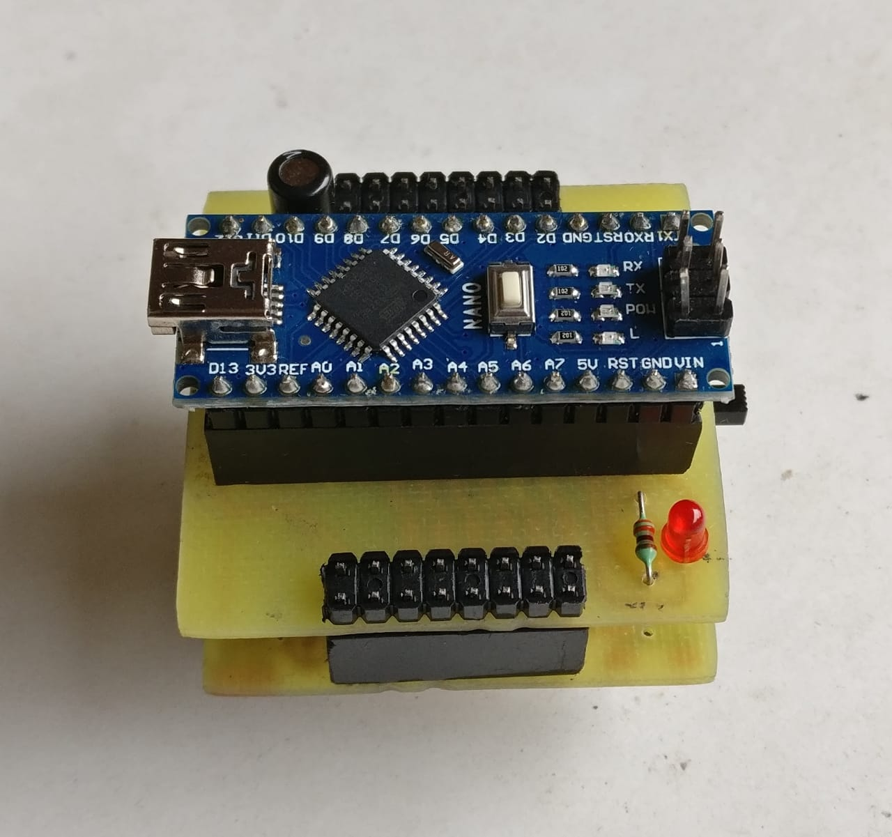
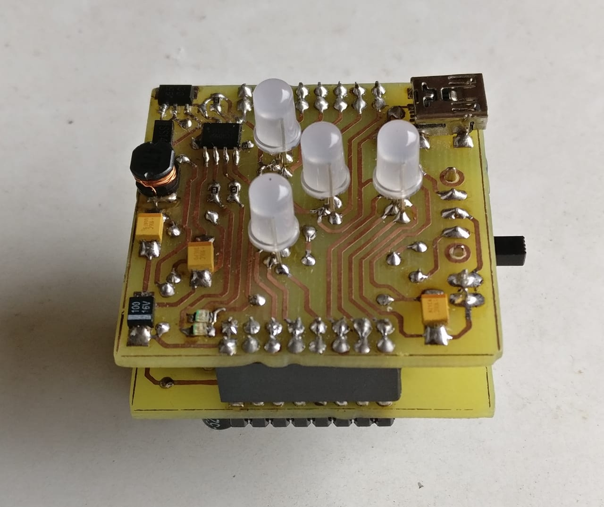
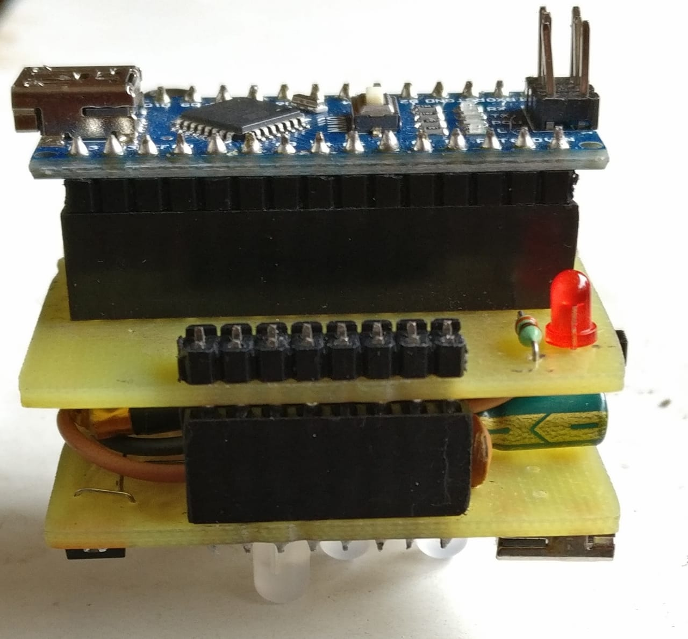
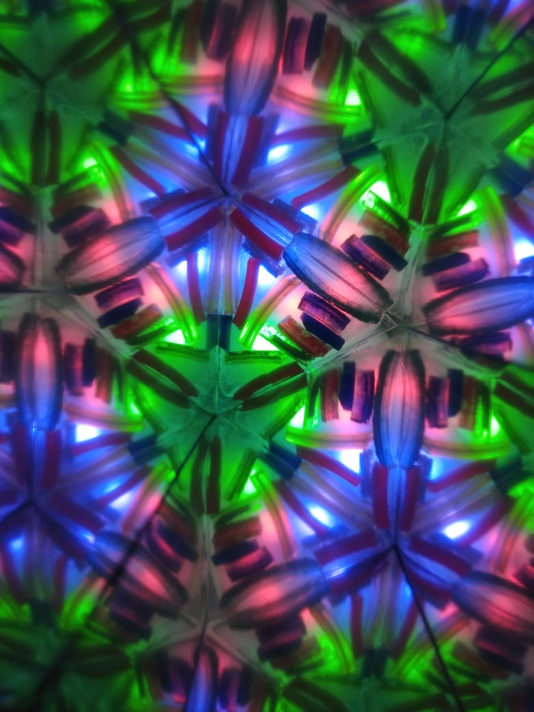
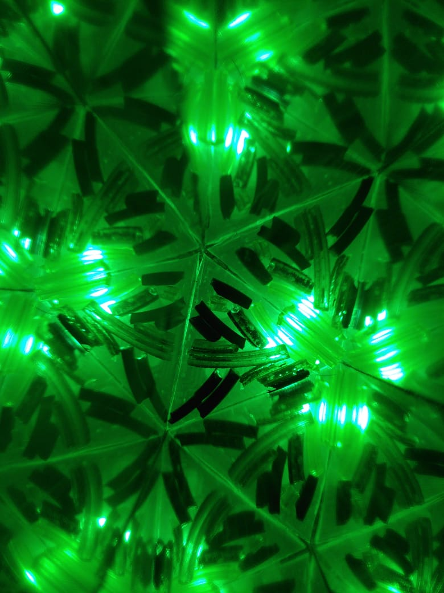
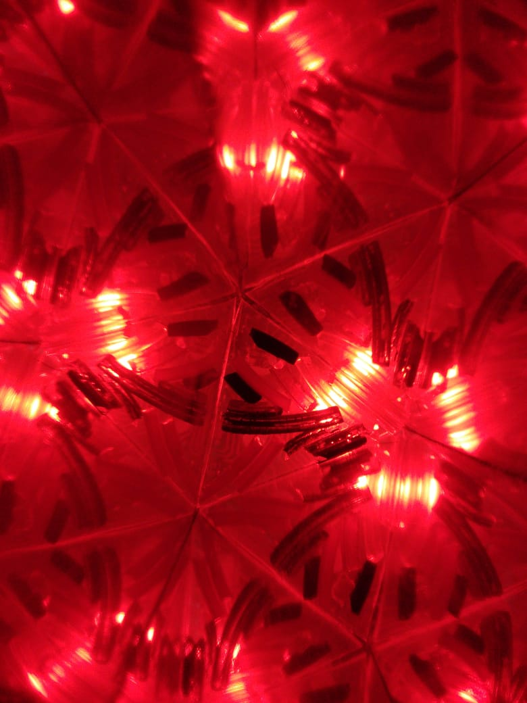

# Kaliedoscope
This project is arduino based Kaliedoscope, developed at CEDT, NSUT. It comprises of two layers of boards. Top layer contains 4 RGB LEDs, switch, USB port for charging and connector for lipo battery. The  lower layer consists of Arduino nano, tilt sensors and power on LED. In this repository you can find the schematic and board files of these layers of boards and also the code for arduino (.ino) for this project.
## Images

